# [poro.gg](https://poro.gg/) Clone Coding  
  
Spring & Vue.js

## League of Legends APIs
|API|Feature|
|:--|:--|
|`ACCOUNT`|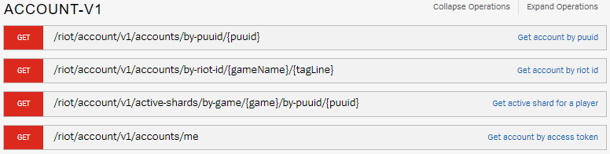|
|`CHAMPION-MASTERY`||
|`CHAMPION`||
|`CLASH`||
|`LEAGUE-EXP`||
|`LEAGUE`|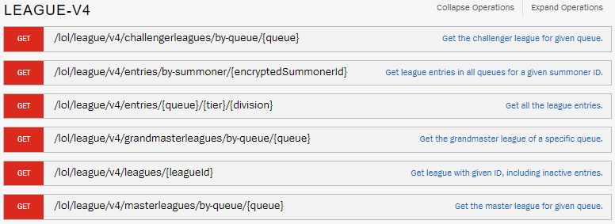|
|`LOL-CHALLENGES`||
|`LOL-STATUS`||
|`LOL-STATUS`||
|`LOR-DECK`|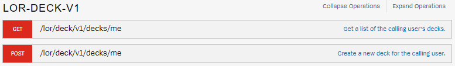|
|`LOR-INVENTORY`|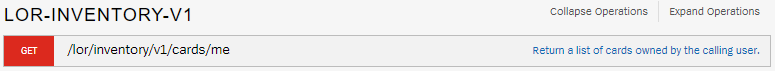|
|`LOR-MATCH`|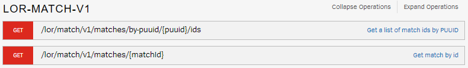|
|`LOR-RANKED`|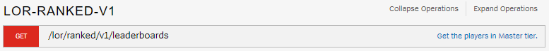|
|`LOR-STATUS`||
|`MATCH`||
|`SPECTATOR`|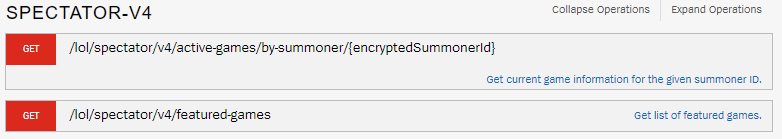|
|`SUMMONER`||
|`TFT-LEAGUE`||
|`TFT-MATCH`||
|`TFT-STATUS`|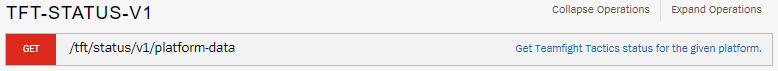|
|`TFT-SUMMONER`|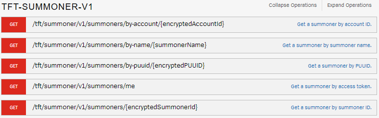|
|`TOURNAMENET-STUB`|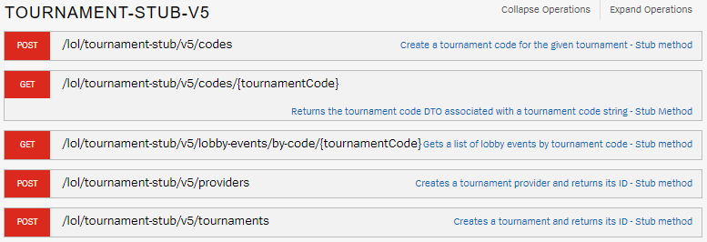|
|`TOURNAMENET`|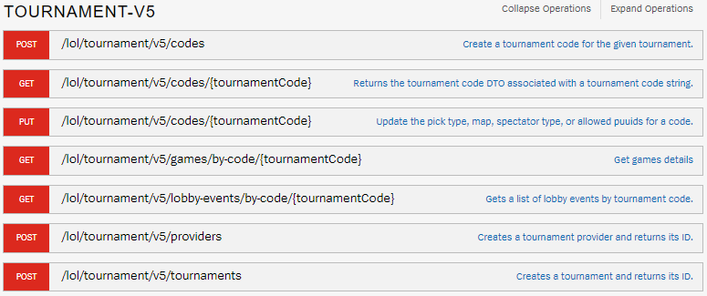|
|`VAL-CONTENT`||
|`VAL-MATCH`|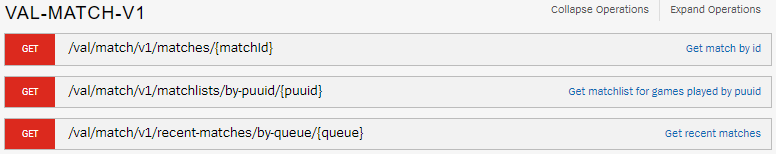|
|`VAL-RANKED`|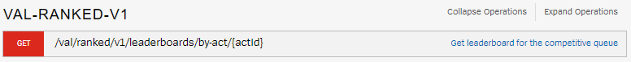|
|`VAL-STATUS`||

